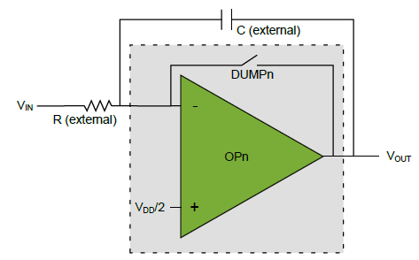

# Getting started with Mindi™ simulation and AVR®DB microcontrollers
This guide will get you up and running with simulating the analog OPAMP module in AVR DB family devices using the Mindi simulation tool.
## Configuration: Integrator
The op amp can be configured to act as an integrator, using an external capacitor and resistor.
The integrator can be reset by the event system.

### Mindi Simulation

Download and open the **Mindi schematic [here](schematics/)**

Press the _play_ button to simulate with an example stimulus source.

### Tweaking
The rate of integration can be adjusted by changing the external component values. The internal configuration has no adjustable parameters.

### Don't have Mindi?
Download and install [Mindi simulation tool](https://www.microchip.com/mplab/mplab-mindi)
